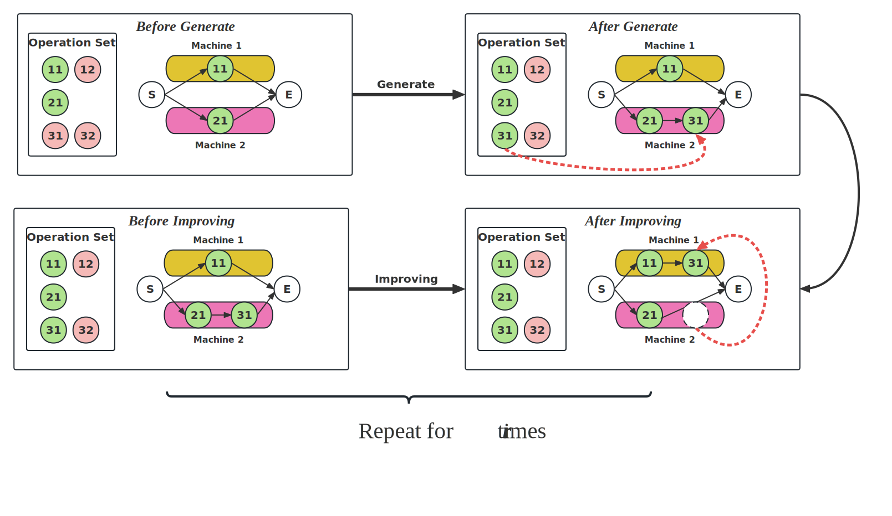

# Simultaneous Generation and Improvement:A Unified RL Paradigm for FJSP Optimization

---

## overview

---

## Running

---
Creating the scripts FSJP instance data by running `./dataprocess/CreatInstance`.

    def main():
        '''
        Generate Random instance by parameters
        '''
        batch_size = 50
        num_jobs = 20
        num_mas = 5
        opes_per_job_min = int(num_mas * 0.8)
        opes_per_job_max = int(num_mas * 1.2)
        case = CaseGenerator(num_jobs, num_mas, opes_per_job_min, opes_per_job_max,
                             flag_same_opes=False, flag_doc=True,
                             path='../dataset/2005test/')
        for each_case_index in range(batch_size):
            case.get_case(each_case_index)

Training model by running `./DuelingDQN_Train_main.py`. And all of the parameters be modified in file `./config.json`.
All of the training data will be saved in `./runs`.

Evaluating the model by running `./evaluate.py`. Experiments result will be saved in `./render_result`.
